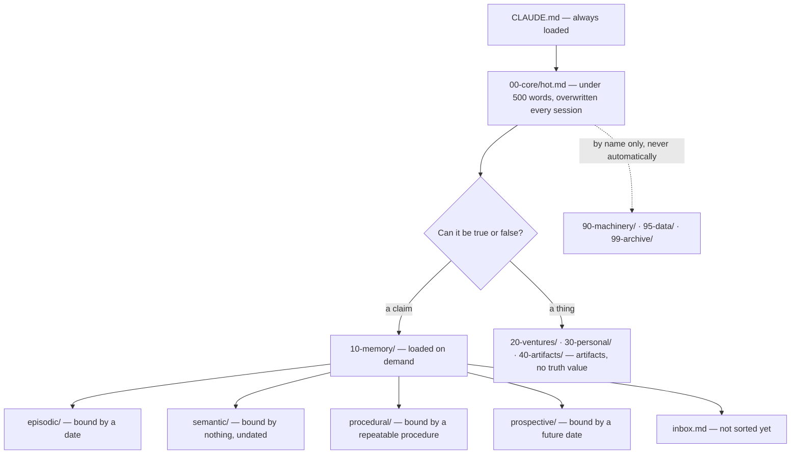

# Ulpia

**A file-system memory architecture for AI agents.** Typed markdown, a placement
algorithm an agent can execute without judgment, and a nightly consolidation loop.
In daily production since June 2026. No vector database.

*Straight to setup: [Quickstart](#quickstart).*



Most agent-memory projects give you a store and leave the hard part to you: **deciding
where a thing goes.** Ulpia's contribution is the two rules that make that decision
mechanical — a hard split between *claims* and *artifacts*, and a placement procedure
you run top to bottom and stop at the first match. Two people filing the same file land
in the same folder. So do two agents.

Named after the *Bibliotheca Ulpia*, Trajan's library in Rome — Greek and Latin halls
flanking his column, and the only Roman library confirmed to have survived to the fall
of the empire that built it. Plain files outlast the systems stacked on top of them.

---

## Why files

**Because a literal search over a purposefully-shaped tree is a serious retrieval
strategy, not a fallback.** A 2026 study of agentic search — *Is Grep All You Need? How
Agent Harnesses Reshape Agentic Search* ([arXiv:2605.15184](https://arxiv.org/abs/2605.15184),
Sen, Kasturi, Lumer, Gulati and Subbiah) — compared grep-based retrieval against vector
retrieval across agent harnesses on 116 LongMemEval questions and found grep generally
scored higher in that comparison. Their own caveat matters and is repeated here: results
"depend strongly on which harness and tool-calling style is used." This is not *vector
search is bad*. It is that the shape of your file tree **is** your retrieval index, and
it is a design surface most people leave on the floor.

Three more reasons, none of them about benchmarks:

- **Auditability.** You can read the entire memory. Every claim names where it came
  from, every change is a diff, and when the agent says something wrong you can find the
  exact line that made it wrong.
- **Zero infrastructure.** Markdown in a git repo. Nothing to host, nothing to migrate,
  no embedding model to re-run when it gets deprecated.
- **Model-agnostic and portable.** The memory is not coupled to a vendor, an SDK or a
  schema version. Swap the model and the memory is untouched.

---

## The one rule

**Memory holds claims. Everything else holds artifacts.**

A **claim** is a sentence that can be true or false and can go stale.
An **artifact** is a thing; it has no truth value and becomes irrelevant instead.
The boundary is *what the thing is and who maintains it* — **never what it is about.**

That last line is the whole design. Sort by subject and every file about one customer
has two defensible homes; sort by what it *is* and there is exactly one right answer.

---

## Quickstart

```bash
git clone https://github.com/pretending2bejhon/ulpia.git
cp -r ulpia/skeleton my-vault
cp ulpia/docs/conventions.md my-vault/00-core/meta/conventions.md
```

Then:

1. Open `my-vault/CLAUDE.md` and fill every angle-bracketed slot — OPERATOR, AGENT-NAME
   and VENTURE — then delete the setup paragraph.
2. Point your agent at the vault. Any agent that can read and write files will do.
3. First session: it reads `CLAUDE.md`, then `00-core/hot.md`, and nothing else until
   the task needs more.
4. Capture into `10-memory/inbox.md` whenever placement is unclear. Sorting it out is
   consolidation's job, not yours.

That is the whole setup. Everything below is explanation.

---

## The typed tree

Numbers are spaced by ten so a tier can be inserted without renumbering.

| Tier | Holds | Loaded |
|---|---|---|
| `00-core/` | identity and conventions — config, not memory | boot file only |
| `10-memory/` | **claims**, agent-maintained | on demand |
| `20-ventures/` | work artifacts, five folders per venture | on demand |
| `30-personal/` | personal artifacts | on demand |
| `40-artifacts/` | rendered output a human reads | on demand |
| `90-machinery/` | code that runs | **by name only** |
| `95-data/` | bulk and raw external input | **by name only** |
| `99-archive/` | dead material | never |

**Below 90 is knowledge. 90 and above is not.** Machinery is code and raw input is
attacker-controllable text, so neither enters a session by accident. The boundary is a
number in a folder name, which means an agent enforces it without reading the contents.

Kind is carried by a filename suffix, never by a second folder layer:

| Suffix | Type | Answers |
|---|---|---|
| `__fact` | fact | what is true right now |
| `__log` | log | what happened |
| `__sop` | sop | how to do it, and what breaks when you don't |
| `__plan` | plan | what is intended |
| `__decision` | decision | what was ruled, and what was rejected |
| `__entity` | entity | stable facts about a person, org or thing |
| `__hub` | hub | one page linking the scattered parts of one system |
| `_*-index.md` | index | the routing table for one folder |

The double underscore is deliberate: it does not break into separate words for a
word-boundary matcher, so `rg --files -g '*__sop.md'` is exact. Full mechanics in
[docs/conventions.md](docs/conventions.md) §5.

### What a note actually looks like

```yaml
---
title: Kiln capacity model
type: fact
domain: studio
status: active
created: 2026-05-04
reviewed: 2026-05-04
review_interval_days: 30
owner: Mara Voss
source: "[[2026-05-02_cafe-lumen-first-order__log]]"
source_type: internal
load_bearing: "The old kiln completes four firings in a normal week."
load_bearing_status: UNVERIFIED
verify: 'rg -q "four firings a week" 10-memory/procedural/studio/bisque-firing-schedule__sop.md'
tags:
  - type/fact
  - domain/studio
  - kind/model
---
```

And the body opens with the line that matters, above the arithmetic:

> **Falls over if:** the old kiln does not complete four firings in a normal week —
> `UNVERIFIED`.

**Any number that governs a decision names its own breaking assumption first**, and
carries a `verify:` the nightly loop actually executes — so a gate nobody checked becomes
a row in tonight's report instead of silence. A caveat at the bottom of a note arrives
after the reader has already believed the number. The whole file is
[in the example vault](example-vault/10-memory/semantic/studio/kiln-capacity-model__fact.md).

---

## A tour of the example vault

[`example-vault/`](example-vault/) is a complete, working vault belonging to **Mara
Voss**, a fictional solo ceramicist. She sells wholesale to cafés and teaches a Saturday
class; her agent is called Clay. Over one month a café places a first wholesale order,
the order strains her single kiln, and everything that follows — a capacity model, a
decision, a supplier switch, an autumn plan — is recorded the way this method says to
record it.

**She is invented. No real business, person, place or price appears anywhere in this
repository.**

Five files worth opening, each for one convention:

- [`kiln-capacity-model__fact.md`](example-vault/10-memory/semantic/studio/kiln-capacity-model__fact.md)
  — **the falls-over line.** A number that governs a decision names the assumption under
  it on body line one, and carries a `verify:` the nightly loop actually executes.
- [`glaze-supplier-north-shore__fact.md`](example-vault/10-memory/semantic/suppliers/glaze-supplier-north-shore__fact.md)
  — **validity, not patching.** A claim that stopped being true keeps its own text and
  gets `superseded_by:`. Compare it against
  [its successor](example-vault/10-memory/semantic/suppliers/glaze-supplier-hearthline__fact.md).
- [`2026-05-02_cafe-lumen-first-order__log.md`](example-vault/10-memory/episodic/2026-05/2026-05-02_cafe-lumen-first-order__log.md)
  — **typed observation lines.** `- [decision]`, `- [constraint]`, `- [risk]`, so that
  one search returns every decision ever made.
- [`clay__hub.md`](example-vault/10-memory/semantic/systems/clay__hub.md)
  — **a system is a `domain:` value, never a folder**, because its parts have different
  lifecycles. The hub reassembles it with one query.
- [`CLAUDE.md`](example-vault/CLAUDE.md)
  — **the boot file**, filled in: load order, the one rule, the write policy.

---

## Lessons from the first months

Seven things this cost to learn. They are the reason the rules above look the way they
do, and every one of them failed **silently** the first time.

**Six processes writing one file produce fewer files than success messages.** Lost
writes do not error. They are reported as recorded, which is strictly worse than a crash
— a crash gets noticed. One working file per session, never a shared one.

**Discipline is not a control where a mechanical gate is possible.** A verification rule
followed by hand held **27 times out of 55** — about half. That number is why load-bearing
claims carry a `verify:` key a script executes, instead of a convention everyone agrees
with and forgets under pressure.

**A cache that is not overwritten is a log with a misleading name.** One stale section
sat in a session's always-loaded context and cost roughly **11% of every boot** before
anyone noticed, because nothing about a stale line looks different from a fresh one.

**An unscoped search returns several times the noise of a scoped one** — measured at
three to ten times on the earlier layout, which is precisely what motivated the
restructure into tiers. The search space is a design surface. You are already paying for
it; you may as well shape it.

**A rule that names a path from outside the thing it governs fails open when the path
moves.** Matching nothing is a valid result, not an error, so the rule keeps reporting
success while permitting exactly what it existed to prevent. Put the rule inside the
thing it protects.

**Renames orphan every inbound link and nothing errors.** Editors rewrite wikilinks only
when the editor itself performs the rename. A rename is a three-step transaction: move,
rewrite inbound links, update the index.

**Two taxonomies over one corpus is how structure rots.** Split a folder on two axes at
once and every new file gets two defensible homes — half end up in each, and no single
search finds them all. One axis per folder level, chosen because it answers the most
queries.

---

## Honest comparison

Ulpia is not a competitor to embedding-based agent memory. It is a different trade, and
here is the trade:

| | Ulpia (files) | Embedding-based memory |
|---|---|---|
| Verbatim recall of what you wrote | strong — you get the file, not a paraphrase | weaker; retrieves by similarity |
| Similarity across different wording | weak — a literal search needs shared words | strong; this is the whole point |
| Auditability | read the whole store, diff every change | opaque by construction |
| History | git, free | needs to be built |
| Infrastructure | none | a service, a model, a schema |
| Scale across many users | poor | strong |
| Synthesis over thousands of documents | poor | strong |
| Portability across models and vendors | total | coupled |

**Use both where each is strong.** A file vault for the things you must be able to
quote, audit and correct; a vector layer for fuzzy recall across a corpus too large to
read. What this method refuses to trade away is the property that makes memory
trustworthy: you can read all of it and know exactly why it said what it said.

---

## Documentation

| Read this | For |
|---|---|
| [docs/memory-model.md](docs/memory-model.md) | why memory splits into four types, and what goes in it |
| [docs/conventions.md](docs/conventions.md) | naming, front-matter, placement, growth, lint — the mechanics |
| [docs/consolidation.md](docs/consolidation.md) | the nightly loop: draining, promotion, belief decay |
| [skeleton/](skeleton/) | the empty tree your vault starts as a copy of |
| [example-vault/](example-vault/) | all of it, demonstrated |

---

MIT licensed — see [LICENSE](LICENSE). Built and maintained by Jhonalbert Alvarez, for
one working agent, before it was for anyone else.
