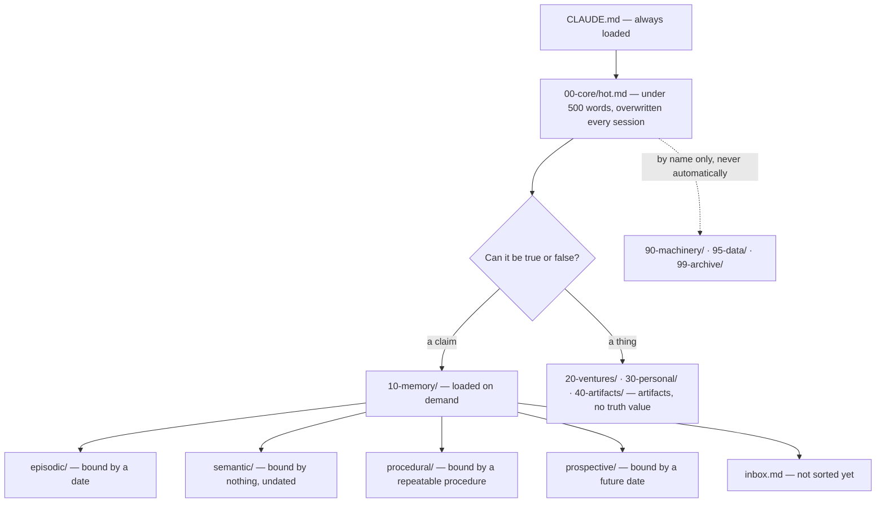

# The memory model

This document answers one question: **what goes in memory, and what does not.**

It does not cover naming, front-matter, folder shapes or growth thresholds — those are
mechanical and they live in [conventions.md](conventions.md). Read this one first
anyway. Every rule in that file is downstream of the split described here, and the
mechanics are much easier to follow once the split makes sense.

---

## The one rule

**Memory holds claims. Everything else holds artifacts.**

A **claim** is a sentence that can be true or false and can go stale.
An **artifact** is a thing. It has no truth value.

"The café orders forty mugs a month" is a claim. It can be checked, it can be wrong,
and it will quietly stop being true at some point without anyone editing it. The
wholesale catalogue you send that café is an artifact. Asking whether it is *true* is a
category error. It is a document; it either helps or it doesn't, and one day it is
simply out of date and gets replaced.

Claims decay. Artifacts become irrelevant. Those are different failure modes, they need
different maintenance, and mixing them in one folder means neither gets the treatment
it needs.

## Why the boundary is *what it is*, never *what it is about*

This is the part people get wrong, and it is worth being blunt about the cost.

The intuitive way to organise a working vault is by subject: a folder per client, a
folder per project, everything about that client in one place. It feels obviously
right. It fails within weeks, and here is the mechanism.

Take one client. There is a note recording what they order and on what terms — a claim,
maintained by the agent, subject to going stale, worth reviewing every quarter. There
is also the invoice you sent them — an artifact, written once, never reviewed, and
never true or false. Sort by subject and both land in `clients/acme/`. Now every new
file about that client has **two defensible homes**, and the person filing it has to
make a judgment call. Judgment calls are not reproducible. Two sessions, or two people,
file the same kind of thing in two different places, and six months later a search that
should have returned three things returns one.

Sort by *what the thing is* and the question disappears. The claim goes to memory. The
invoice goes to the venture folder. There is exactly one right answer, an agent reaches
it without inference, and the fact that they are about the same client is recovered by
a query — not by a folder.

**A claim about a client and an artifact for that client living in different trees is
not a compromise. It is the design working.**

---

## The shape of a session

Two things in that picture do most of the work.

**The boot path is fixed and tiny.** A session always loads the same two files: the
boot file, and a cache of what is true right now that is under five hundred words and
gets overwritten completely every session. Everything else is pulled on demand. The
cost of starting a session does not grow as the vault grows — which is the property
that makes a file-system memory viable at all.

**The 90-line is a wall, not a suggestion.** Machinery is code and raw data is
attacker-controllable text. Neither is knowledge, so neither enters a session unless a
human names it in the request. The boundary is a number in a folder name, which means
an agent enforces it correctly without understanding what is inside.

---

## The four types

Pick the type by **how the claim is bound**, not by what it is about. The binding is
observable, so this is a lookup rather than a judgment.

| Type | Answers | Bound by | Goes stale when |
|---|---|---|---|
| `episodic/` | what happened, and what was decided | **a date** | never — it happened |
| `semantic/` | what is true right now | **nothing** — undated | the world changes |
| `procedural/` | how to do it, and what breaks when you don't | **a repeatable procedure** | the process changes |
| `prospective/` | what is intended | **a future date** | the date passes |
| `inbox.md` | not sorted yet | — | it is drained |
| `working/` | this session's scratch | one file per session | the session ends |

Worked examples from the same week in one small studio:

- *"On 2 May the café placed a first wholesale order for sixty pieces."* → **episodic.**
  Bound to a date. It will never stop being true, and it will never need reviewing.
- *"The café orders monthly, pays on delivery, and wants unglazed rims."* → **semantic.**
  Undated, true right now, and the single most likely thing in the vault to be silently
  wrong in six months. This is what review intervals are for.
- *"A bisque load ramps at 100°C an hour, holds two hours, cools overnight."* →
  **procedural.** Bound to a procedure. It changes when the process changes, not when
  the world does.
- *"Cut the autumn wholesale line by the end of September."* → **prospective.** Bound to
  a future date, and self-retiring: once the date passes it is either done or it was
  not.

Notice that all four of those are about the same business, and three of them mention
the same café. Subject is not the axis. Binding is.

### Why four, and why these four

Each type has a **different expiry mechanism**, and that is the only reason a type
exists. A dated event never expires. An undated fact expires when reality moves. A
procedure expires when the process changes. An intention expires on a calendar date.

If you propose a fifth type, ask what makes it decay. If the answer is one of the four
above, it is not a new type — it is a domain, and domains are a query axis, not a
folder. If two of the four ever share an expiry mechanism, merge them.

---

## Where a session may write

| Path | Policy |
|---|---|
| `working/` | append freely — **one file per session, never a shared one** |
| `inbox.md` | append freely |
| `episodic/` | append freely |
| `prospective/` | append freely — a plan is authored, not derived |
| `semantic/` | **consolidation only** |
| `procedural/` | **consolidation only** |

The full table, covering every tier and closing with *anything not listed above → ask
first*, is in [conventions.md](conventions.md) §9.

**Semantic and procedural memory are the two types a live session may not write**, and
that asymmetry is deliberate.

Those two are the durable, undated layers — the ones that get loaded most often and
questioned least. They are also the only ones where two sessions running at once would
plausibly want to edit the *same* file, because they are organised by subject rather
than by date or by session. Concurrent writes to one file do not error. They produce
fewer files than success messages: writes are lost silently and reported as recorded.

So a session that discovers a durable fact does not write it to semantic memory. It
writes it to its own working file — one file per session, no contention possible — and
a single consolidation pass promotes it later, alone, with nothing else running. One
writer, one moment, one file.

The dated types are safe to append to directly because their names are unique by
construction: a session log and a decision record are bound to a moment that has
already happened, and two sessions do not write the same moment.

The promotion pass itself — what it drains, what it stamps, and how it reports — is
[consolidation.md](consolidation.md).

---

## The inbox, and why guessing is worse than not knowing

Every routing procedure needs a legal answer for "I don't know." Without one, an agent
under pressure to be useful will pick the most plausible folder and move on.

`inbox.md` is that answer: append-only, unstructured, no front-matter, drained by
consolidation into the typed folders.

**Flag rather than guess.** An honest unsorted line costs a moment of the next
consolidation pass. A confident wrong placement costs the claim outright — not because
it was deleted, but because nobody will ever look for it where it went. The unsorted
line is visible and annoying, which is exactly why it gets fixed. A misfiled claim is
invisible and calm.

One consequence worth stating out loud: **capture alone never creates a task.** A line
in the inbox is an unsorted claim and nothing more. If everything captured became
actionable, the cheap capture path would stop being cheap and people would stop using
it.

---

## What this model does not do

It is worth being straight about the shape of the trade.

This model is built for **verbatim recall of things you wrote down**, with a full audit
trail and no infrastructure. It is very good at "what did we agree with that supplier,
and when did it change." Structure is the retrieval index; a search over a
purpose-shaped folder tree is precise, cheap, and inspectable, and the file that comes
back is the file you wrote, not a paraphrase of it.

It is not a similarity engine. It will not surface the conceptually-related note that
shares no wording with your query, it does not scale to many users over one corpus, and
it will not do fuzzy synthesis across thousands of documents. Those are real strengths
of embedding-based memory, and nothing here argues you should not use both.

What this model refuses to give up is the property that makes an agent's memory
trustworthy: **you can read the whole thing, diff it, and know exactly why it said what
it said.**

---

Next: [conventions.md](conventions.md) — the mechanics. Naming, front-matter, placement
edges, growth thresholds, and the lint checklist.
